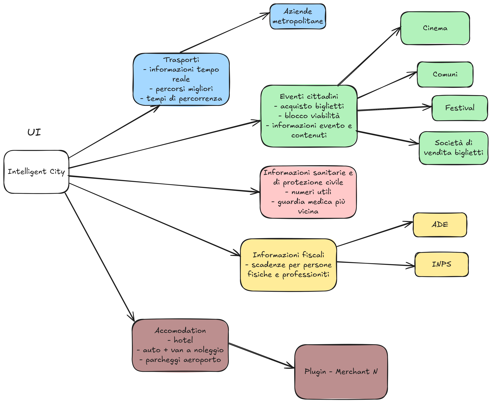

# Applicazione Multiagenti AI con .NET ASPIRE
Creare più agenti che collaborano tra loro, integrandoli con .NET ASPIRE. Configurare ciascun agente con un compito specifico e collegarli mediante API interne. Assicurarsi che ogni agente sia scalabile e che la comunicazione sia asincrona.

## Tabella dei Servizi
| Servizio  | Descrizione                        |
|-----------|------------------------------------|
| Agente 1  | Gestione di richieste utente       |
| Agente 2  | Elaborazione dati e analisi        |
| Agente 3  | Integrazione con servizi esterni   |
| Agente 4  | Orchestrazione e coordinamento     |

## Schema Funzionale

## Schema Architetturale
